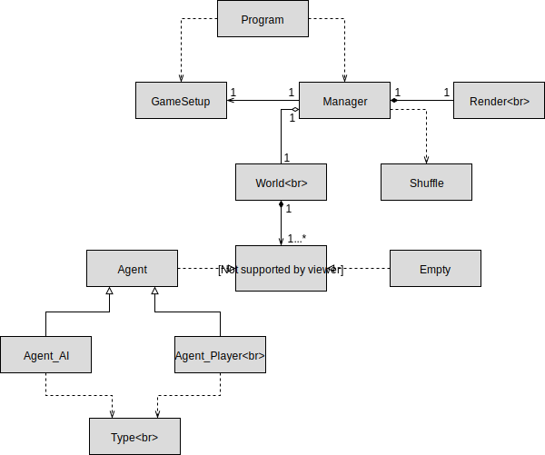
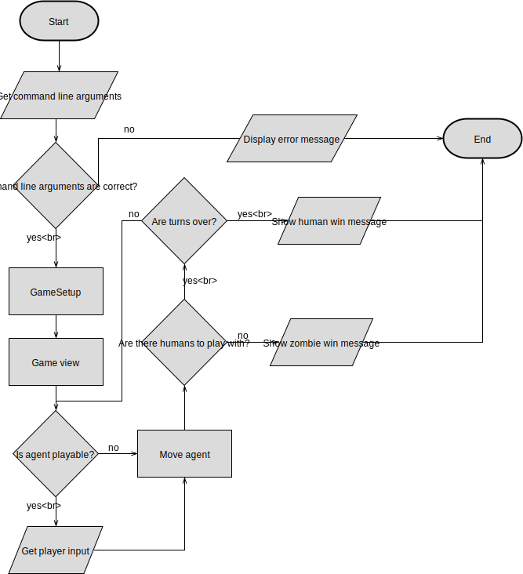

# 2º Projeto de Linguagens de Programação 1 E

###### Projeto realizado por:
Joana Marques a21701929 <p>
Pedro Santos a21702907

##### Link do repositório GitHub : https://github.com/pedrosantosobral/ProjetoLP_2E

### Relatório:
Pedro: <p>
- Criou as primeiras classes: GameSetup e Type; <p>
- Fez o spawn dos agentes na classe World; <p>
- Criou a classe Render, Agent e Shuffle; <p>
- Fez o view do jogo e algumas alterações no código para usar a classe Agent. <p>
- Fez o método para colocar os agentes no array para fazer o shuffle. <p>
- Fez a verificação do movimento dos agentes para não irem para fora da grid. <p>
- Começou a visualização do jogo. <p>
- Fez o save game e adicionou comentários. <p>
- Pesquisou os unicodes a ser usados. <p>
- Fez o fluxograma. <p>

Joana: <p>
- Criou a interface IGameObject a classe World, Manager e Empty; <p>
- Modificou as classes dos agentes (Agent_AI e Agent_Play); <p>
- Fez pseudocódigo do spawn de agentes na classe World. <p>
- Fez o código para o movimento dos agentes e colocou-os a mexer na visualização. <p>
- Fez a vizinhança de Von Neumann. <p>
- Fez as verificações de vitória. <p>
- Fez a correção de erros e testes gerais do programa. <p>
- Fez o diagrama UML. <p>

O relatório foi feito por todos os elementos do grupo.

### Solução:
##### Arquitetura:
Separámos o código em várias classes.
Cada classe desepenha uma determinada função no código. <p>
O `Program` inicializa o jogo. <p>
O `World` classe que cria o game world e enche a grid. <p>
A classe `Shuffle`  serve para fazer o shuffle dos agentes. <p>
A interface `IGameObject` controla todos os game objects. <p>
A classe `GameSetup` recebe os argumentos passados na linha de comandos. <p>
A classe `Empty` funciona como um game object vazio. <p>
A classe `Agent_Play` contém informação sobre os agentes controlados pelo joagdor. <p>
A classe `Agent_AI` contém informação sobre os agentes controlados pela AI. <p>
A classe `Agent` contém as diferentes propriedades dos agentes. <p>
O `Render` imprime todo o game view. <p>
O `Manager` é o game manager. <p>
A enumeração `Type` contém os tipos dos agentes. <p>

As estruturas de dados que utilizámos no nosso código foi `arrays`, `enumerações`. <p>

Um dos algoritmos que usámos foi da vizinhaça de Von Neumann

```cs
for (radius = 1; radius <= max_search; radius++)
{
if (FLAG == 1) break;
for (destRow = -radius; destRow <= radius; destRow++)
{
if (FLAG == 1) break;
for (destCol = -radius; destCol <= radius; destCol++)
{

if (Distance_vn(ag.Row, ag.Col, ag.Row + destRow, ag.Col
+ destCol) == radius)
{
int rowCoord = ag.Row + destRow;
int colCoord = ag.Col + destCol;

// Verification for the bottom. if the position is
//outside the grid set to last row.
if (rowCoord >= gs.Row) rowCoord = gs.Row - 1;
// Verification for the top. if the position is
//outside the grid set to first row.
else if (rowCoord < 0) rowCoord = 0;
// Verification for the right side. if the position is
//outside the grid set to last collumn.
if (colCoord >= gs.Col) colCoord = gs.Col - 1;
// Verification for the left side. if the position is
//outside the grid set to first collumn
else if (colCoord < 0) colCoord = 0;

if (w.grid[rowCoord, colCoord] is Agent)
{
if ((ag.Type == Type.Human) &&
((w.grid[rowCoord, colCoord] as Agent).Type == Type.Zombie))
{
Console.WriteLine($"Nearest Zombie ID:" +
$" {(w.grid[rowCoord, colCoord] as Agent).Id}");
HumanMove(ag as Agent_AI, w.grid[rowCoord, colCoord] as Agent);
FLAG = 1;
break;
}
else if ((ag.Type == Type.Zombie) &&
((w.grid[rowCoord, colCoord] as Agent).Type == Type.Human))
{
Console.WriteLine($"Nearest Human ID:" +
$" {(w.grid[rowCoord, colCoord] as Agent).Id}");
ZombieMove(ag as Agent_AI, w.grid[rowCoord, colCoord] as Agent);
FLAG = 1;
break;
}
}
}
}
}
}
```

##### Diagrama UML:

##### Fluxograma:


### Conclusões
Com este projeto melhorámos os nossos conhecimentos de c#.
Achamos que a vizinhança de Von Neumann foi a parte mais difícil de fazer.

### Referências
* Discussão sobre o projeto com alguns colegas de turma.
* [Save Game](https://www.youtube.com/watch?v=jbwjbbc5PjI&t=321s)
* [Vizinhança de von Neumann](https://github.com/synpse/ic2017p2e)
* [Lista de Unicodes](https://unicode-table.com/pt/)
* [Fisher Yates shuffle](https://stackoverflow.com/questions/25943286/fisher-yates-shuffle-on-a-cards-list)
